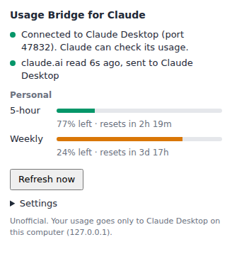

# claude-usage-checker

Claude Desktop で、Claude（AI）自身が **5時間制限** と **週間制限** のあと何 % 残っているかを確認できるようにする拡張機能です。

Claude に「使用量はあとどれくらい残ってる？」と聞けば答えてくれます。長い作業の前や途中では Claude が自分で残りを確認し、上限に達する前に作業をまとめられるようになります。



## しくみ

```text
Claude「使用量の残りは？」
   │ get_claude_usage ツール
   ▼
Claude Desktop ─ デスクトップ拡張「Claude Usage」
   │ ① 読んで（このパソコンの中だけ：127.0.0.1）
   ▼
Chrome / Edge ─ ブラウザ拡張「Usage Bridge for Claude」
   │ ② ブラウザのログインのまま使用量を読む
   ▼
claude.ai

答えは同じ道を戻って、数秒で Claude に届きます。
```

- パスワード・Cookie・トークンを貼り付ける必要はありません。ログイン情報はブラウザの外に出ません。
- 使用量の数字は、このパソコンの中（127.0.0.1）でだけ受け渡しします。
- **claude.ai を読むのは、Claude が聞いたときだけです。** 定期的なチェックはしません。聞かれるとブラウザがその場で読み取り、数秒で答えます（直前 60 秒以内に読んだ値があればそれを使います）。
- そのためにブラウザ拡張は Claude Desktop と接続を 1 本つないだままにします（このパソコンの中だけの通信）。Claude Desktop が起動していない間は、1 分に 1 回つなぎ直しを試みるだけで、claude.ai にはアクセスしません。

## 必要なもの

- Claude Desktop（macOS / Windows / Linux）
- Google Chrome または Microsoft Edge で claude.ai にログインしていること
- 5時間・週間の制限がある Claude のプラン（Pro / Max / Team など）

## インストール（ターミナル操作は不要）

### 1. Claude Desktop に拡張機能を追加する

1. [`dist/claude-usage.mcpb`](dist/claude-usage.mcpb) を開き、「Download raw file」ボタンでダウンロードします。
2. ダウンロードした `claude-usage.mcpb` をダブルクリックします。Claude Desktop が開くので「インストール」を押します。
   - ダブルクリックで開かない場合は、Claude Desktop の Settings（設定）→ Extensions（拡張機能）の画面にファイルをドラッグ＆ドロップしてください。
3. 拡張機能の一覧で「Claude Usage」が有効になっていることを確認します。

### 2. ブラウザに拡張機能を追加する

1. [`dist/usage-bridge-for-claude.zip`](dist/usage-bridge-for-claude.zip) をダウンロードして展開します（`browser-extension` フォルダができます）。
2. Chrome で `chrome://extensions` を開きます（Edge は `edge://extensions`）。
3. 右上の「デベロッパー モード」をオンにします。
4. 「パッケージ化されていない拡張機能を読み込む」を押して、展開した `browser-extension` フォルダを選びます。
5. 同じブラウザで [claude.ai](https://claude.ai) にログインしておきます。

展開したフォルダは消さずに残しておいてください（ブラウザはそのフォルダから拡張機能を読み込み続けます）。

### 3. 動作を確認する

ブラウザのツールバーの拡張機能ボタン（パズルのピース）から「Usage Bridge for Claude」を開きます。上の画像のように「Claude Desktop connected」と使用量が表示されれば完了です。

Claude Desktop で「今の使用量の残りは？」と聞いてみてください。

### （任意）Skill を追加する

[`dist/claude-usage-skill.zip`](dist/claude-usage-skill.zip) を Claude Desktop の Customize → Skills からアップロードしておくと、「5時間枠の残りが 10% を切ったら新しい大きな作業は始めず、作業を保存してまとめる」といった振る舞いを Claude が覚えます。内容は [`skills/claude-usage/SKILL.md`](skills/claude-usage/SKILL.md) で、好みに合わせて書き換えられます。

## Claude が受け取る情報

`get_claude_usage` ツールは次のような JSON を返します。

```json
{
  "ok": true,
  "summary": "5h: 77% left (resets in 2h19m) | 7d: 59% left (resets in 3d17h)",
  "five_hour": {
    "used_percent": 23,
    "remaining_percent": 77,
    "resets_at": "2026-09-27T18:35:00Z",
    "resets_in_seconds": 8369,
    "severity": "normal"
  },
  "seven_day": {
    "used_percent": 41,
    "remaining_percent": 59,
    "resets_at": "2026-10-01T09:00:00Z",
    "resets_in_seconds": 320429,
    "severity": "normal"
  },
  "stale": false,
  "warnings": [],
  "model_windows": {
    "Fable": { "used_percent": 76, "remaining_percent": 24, "resets_at": "2026-10-01T09:00:00Z", "resets_in_seconds": 320429, "severity": "warning" }
  },
  "organization": { "name": "Personal", "uuid": "…" },
  "source": "browser",
  "observed_at": "2026-09-27T16:15:35Z",
  "age_seconds": 35,
  "generated_at": "2026-09-27T16:16:10Z"
}
```

| フィールド | 意味 |
| --- | --- |
| `ok` | 取得できたか。`false` のときは `error.code` / `error.message` / `error.hint` に理由と対処法 |
| `summary` | 1 行の要約 |
| `five_hour` / `seven_day` | 5時間枠 / 週間枠。制限のないプランでは `null` |
| `*.remaining_percent` / `*.used_percent` | 残り % / 使用 % |
| `*.resets_at` / `*.resets_in_seconds` | リセット時刻（UTC）/ リセットまでの秒数 |
| `model_windows` | モデル別の週間枠（プランにある場合） |
| `stale` | 今回 claude.ai を読めず、前回の値を返したとき `true`（理由は `warnings`） |
| `warnings` | 更新の失敗など、知っておくべきこと |
| `organization` / `other_organizations` | どの組織の値か / ほかの組織の要約 |
| `observed_at` / `age_seconds` | いつ claude.ai から読んだ値か |

ツールの引数（どちらも省略可）:

- `organization`: 組織の名前または UUID（複数の組織に入っている場合）
- `max_age_seconds`: この秒数以内に読んだ値があれば、読み直さずに使う（既定 60。0 なら毎回読む）

## 設定

- **Claude Desktop 側**（Settings → Extensions → Claude Usage → 設定）
  - Organization: 個人プランとチームなど複数の組織に入っている場合に、使う組織の名前。空なら 5時間・週間の制限がある最初の組織を使います。
  - Local port: 受け渡しに使うポート（既定 47832）。ほかのアプリと重なる場合だけ変更し、ブラウザ側も同じ番号にします。
- **ブラウザ側**（拡張機能のポップアップ → Settings）
  - Port: Claude Desktop 側と同じ番号にします。

## うまく動かないとき

| 症状 | 対処 |
| --- | --- |
| ポップアップに「Claude Desktop not reachable」 | Claude Desktop が起動していて、「Claude Usage」拡張が有効か確認します。ポートを変えた場合は両方を同じ番号にします。 |
| ポップアップに「Sign in to claude.ai」 | その拡張機能を入れたブラウザで claude.ai にログインします。 |
| Claude が `browser_not_connected` と答える | 拡張機能を入れたブラウザを起動します。Claude Desktop を起動した直後は、つながるまで最大 1 分かかります。 |
| Claude が `stale: true` と答える | 今回は読めなかったので前回の値です。`warnings` の理由（ブラウザが閉じている、ログインが切れているなど）を確認してください。 |

## 注意点

- **非公式のツールです。** claude.ai の設定画面が使っている内部 API（`/api/organizations` と `/api/organizations/{id}/usage`）を読んでいます。Anthropic の公開 API ではないため、予告なく使えなくなる可能性があります。Anthropic とは関係ありません。
- **利用規約について:** Claude の利用規約は、許可された方法以外のスクリプトなどによる自動アクセスを禁じています。この拡張機能は数分おきに自分の使用量を読むだけですが、非公式な方法であることを理解したうえで使ってください。
- 使用量を読めるのは、拡張機能を入れたブラウザが起動しているときだけです（閉じているときは前回の値を返します）。
- Firefox と Safari には対応していません。
- 動作確認は、Chromium に拡張機能を読み込み、claude.ai の代わりのテスト用サーバーと本物の Claude Desktop 拡張のサーバーを使って行っています（[`e2e/`](e2e/)）。拡張機能の形式は公式ツール（`mcpb`）で検証しています。

## Claude Code（ターミナル版）を使う人へ

ターミナルの Claude Code 向けに、Claude Code 自身から使用量を取るコマンドライン版もあります。ブラウザ拡張は不要です。→ [`cli/README.md`](cli/README.md)

## 開発

```bash
npm test             # Claude Desktop 拡張のテスト
npm run test:e2e     # Chromium を使った E2E テスト（Playwright が必要）
npm run build        # dist/ を作り直す
npm run icons        # アイコンを作り直す
cd cli && python -m unittest   # コマンドライン版のテスト
```

構成:

| パス | 内容 |
| --- | --- |
| `desktop-extension/` | Claude Desktop 拡張（MCP サーバー、Node.js、依存パッケージなし） |
| `browser-extension/` | ブラウザ拡張（Chrome / Edge、Manifest V3） |
| `skills/claude-usage/` | Claude 向けの Skill |
| `dist/` | 配布用ファイル（`npm run build` で生成） |
| `cli/` | Claude Code（ターミナル版）向けのコマンドライン版（Python） |
| `e2e/` | ブラウザ拡張と Desktop 拡張をつないだ E2E テスト |
